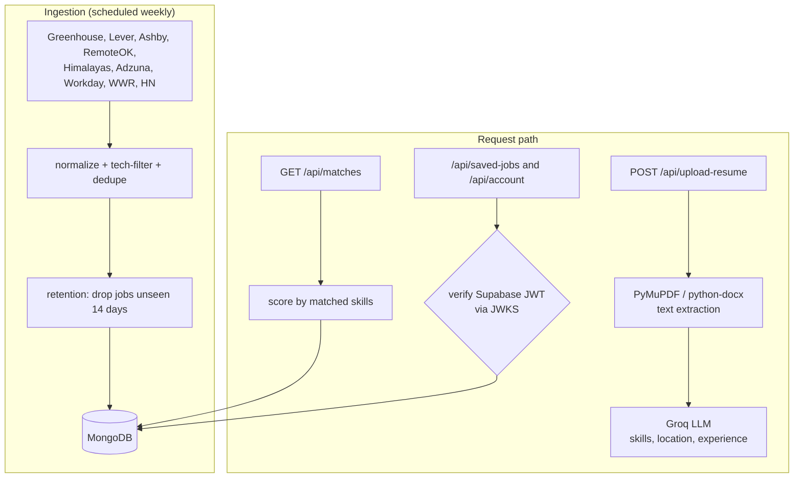

<div align="center">

# Whofy API

### We hunt opportunity for you.

The backend that powers Whofy — a FastAPI service that ingests thousands of live tech jobs every week, parses resumes with an LLM, and ranks matches for each user.

**[Live demo → whofy.vercel.app](https://whofy.vercel.app)**


</div>

> This is the **backend** of Whofy. The React frontend lives in a separate repo: **[whofy-ui](https://github.com/whofy/whofy-ui)**.

---

## Overview

**Whofy** turns a resume into a ranked job shortlist. This service is responsible for three things:

1. **Aggregating jobs** — a pipeline pulls live tech roles from company career pages and job boards, normalizes and de-duplicates them, and stores them in MongoDB (refreshed weekly, expired after 14 days).
2. **Parsing resumes** — an uploaded PDF/DOCX is text-extracted and sent to a Groq LLM, which returns the candidate's skills, location, and experience level.
3. **Matching** — the extracted skills are scored against the job corpus and returned ranked, with server-side filtering, search, and per-user saved jobs.

## Architecture



## What it does

- **Multi-source job ingestion** — Greenhouse, Lever, Ashby, RemoteOK, Himalayas, Adzuna, Workday, We Work Remotely, Hacker News
- **Normalization & de-duplication** across sources, plus a tech-role filter (drops non-tech listings)
- **Retention** — jobs not seen for 14 days are pruned; new jobs added every 24h
- **AI resume parsing** — PDF/DOCX → text → Groq LLM → structured skills/location/experience
- **Ranked matching** — jobs scored by how many of a user's skills appear in the title/description
- **Filtering & search** — source, location, work type, experience level, date posted, full-text search
- **Saved jobs & account deletion** — per-user data, gated behind Supabase JWT auth
- **Scoped chatbot** — a Groq-backed assistant restricted to Whofy/job topics
- **Production hardening** — per-user rate limiting (SlowAPI), gzip, CORS, and a `/api/ready` dependency probe

## Tech stack

| Concern | Tech |
|---------|------|
| Framework | FastAPI (Python 3.12) |
| Database | MongoDB via Motor (async) |
| LLM | Groq |
| Auth | Supabase JWT verification (JWKS, RS256/ES256) |
| Resume parsing | PyMuPDF (PDF), python-docx (DOCX) |
| Rate limiting | SlowAPI |
| Tooling | uv, pytest |

## Getting started

**Prerequisites:** Python 3.12+, [uv](https://docs.astral.sh/uv/), and a MongoDB connection string.

```bash
git clone <this-repo> whofy-api
cd whofy-api
cp .env.example .env        # fill in the values below
uv run uvicorn main:app --reload --port 8000
```

Interactive API docs are then available at `http://localhost:8000/docs`.

## Environment variables

| Variable | Description |
|----------|-------------|
| `MONGODB_URI` | MongoDB / Atlas connection string |
| `GROQ_RESUME_PARSER_API_KEY` | Groq key for resume parsing |
| `GROQ_CHATBOT_API_KEY` | Groq key for the assistant |
| `SUPABASE_URL` | Supabase project URL (JWKS + issuer are derived from it) |
| `SUPABASE_SERVICE_ROLE_KEY` | Admin key — required for account deletion (server-only) |
| `CORS_ORIGINS` | Comma-separated allowed frontend origins |
| `ADZUNA_APP_ID` / `ADZUNA_APP_KEY` | Adzuna source credentials |

## Key endpoints

| Method | Path | Purpose |
|--------|------|---------|
| `POST` | `/api/upload-resume` | Parse a resume → skills/location/experience |
| `GET` | `/api/matches` | Ranked jobs for a set of skills + filters |
| `GET` | `/api/search` | Full-text job search |
| `GET` | `/api/jobs/{id}` | Single job detail |
| `GET/POST/DELETE` | `/api/saved-jobs` | Manage saved jobs (auth) |
| `DELETE` | `/api/account` | Delete account + user data (auth) |
| `GET` | `/api/locations`, `/api/sources` | Filter option data |
| `GET` | `/api/ready` | Readiness probe (Mongo + Supabase) |

## Project structure

```
whofy-api/
├── main.py          # FastAPI app + routers + /api/ready
├── fetch_api/       # jobs, saved_jobs, account, auth, rate limiting
├── parsing/         # resume upload + LLM extraction
├── chatbot/         # scoped assistant service
├── pipeline/        # job ingestion orchestration
├── listings/        # source fetchers + shared normalize/tech-filter
├── db/              # MongoDB client
├── models/          # Pydantic models
├── config/          # settings
└── tests/           # pytest suite
```

## Tests

```bash
uv run pytest
```

## Roadmap

- Semantic / vector matching (embeddings + vector search) beyond keyword matching
- RAG assistant grounded in the live job data
- Background worker + Redis for scheduled ingestion at scale

## Authors

Built as a full-stack project by **Rohan Akode** and **Charan Goud**.
